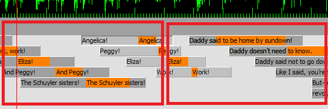

# Edit the lyric displays

Editing the lyric displays is an inherently iterative process.  No set of steps is complete but this is a good starting strategy.  The most important note is to **save often**.  KBS can sometimes crash and losing 30 minutes' worth of work (or more!) is frustrating.

1. Set the lyric sweeping for restored lyrics (roughly)
1. Tune the display
1. Play through and see that it looks approximately ok.
1. Edit lyric sweeping 

1. Edit lyric sweeping for restored lyrics
1. Edit display sweeping to remove collisions
1. Edit the Lyric Sweeping more precisely
1. Edit the display/remove times to match the fixed lyric sweeping
1. Iterate back-and-forth on timing and sweeping until you're satisfied.

## Tips:
- **Save often**
- **Learn the keyboard shortcuts**
  - Shift-arrow adjusts the start of a selected segment
  - Ctrl-ararow adjusts the end
  - Shift-click selects all segments in a line (sweeping) or page (display)
- Lyric wiping should likely be done line-by-line rather than screen-by-screen, because the lyrics move on too quickly to wait for a full screen swipe.
- Playing at slow speed while editing is useful for getting the relative syllable timing correct, but after that you need to play the music in realtime to adjust the timing of the entire line.  Select the whole line and move up/down until it matches the realtime music.
- You probably want your lines to have a ['stair-step gap'](images/display-stairstep-gap.png) a lot of the time.  This means that you never see an older lyric directly beneath a newer lyric, so readers can easily tell what's been replaced and what hasn't.

